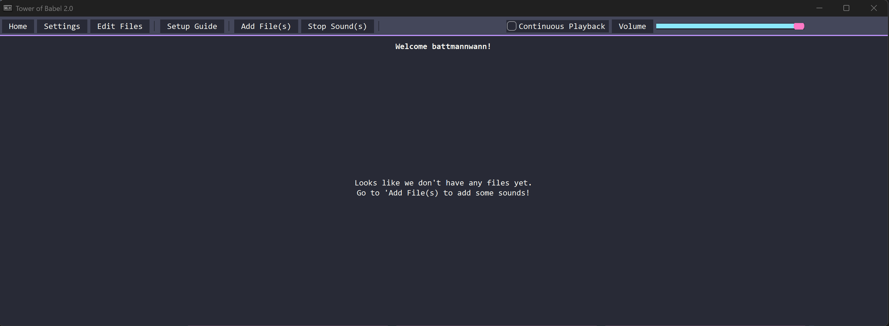
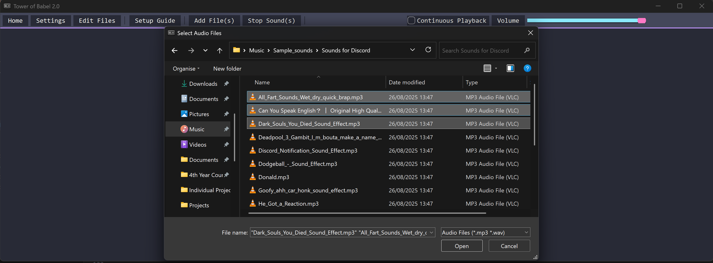
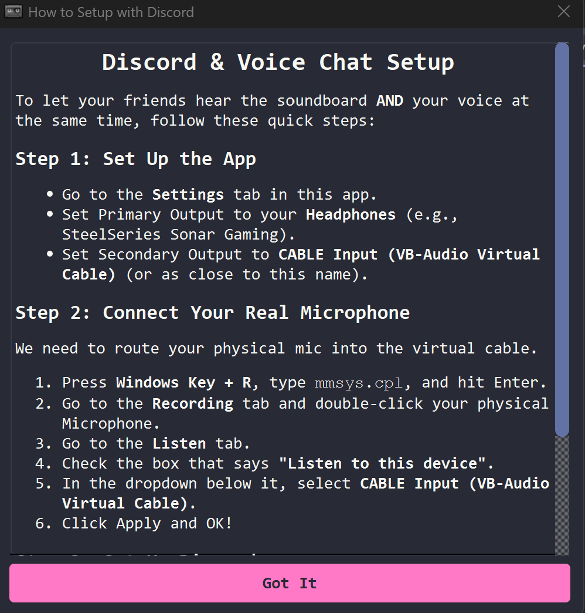
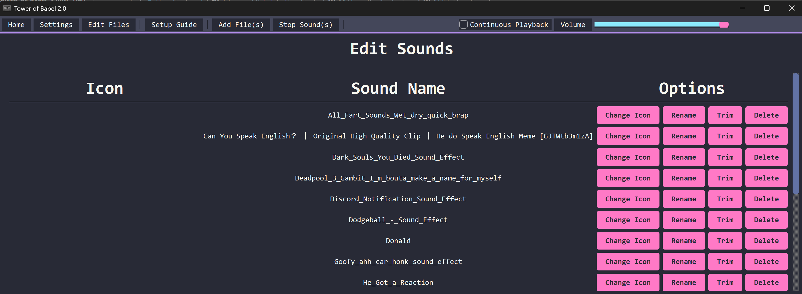
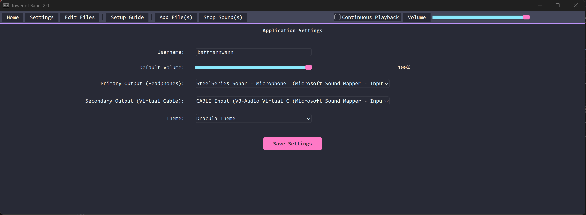

# Tower of Babel 2 - User Guide

This document serves as an in-depth, step-by-step usage walkthrough of the `Tower of Babel 2` application.

Thank you for downloading this app!

---

## Table of Contents

```
1. Downloading the Application
    1.1 Pulling/Downloading the Codebase
    1.2 Downloading and Installing a Release

2. Using the Application
    2.1 Application Overview
    2.2 Adding Sounds
    2.3 Setup Guide
    2.4 Editing Sounds
    2.5 Changing the Settings
    2.6 Other Features

```

---

## Downloading the Application

As this is an open-source project, there are two avenues for download:

1. Pulling/Downloading the source code from the [GitHub Repository](https://github.com/BattmannWann/Tower-of-Babel-2) under the `<> Code` tab
2. Downloading one of the releases from the [`Releases section`](https://github.com/BattmannWann/Tower-of-Babel-2/releases)


### 1. Pulling/Downloading the Codebase

For ease of keeping up to date with the most recent version of the codebase, it is recommended to `git pull` rather than downloading the zip file. Not only is it faster, but it means that you don't have to download and extract the contents each time there is a change.

After pulling the repository, it is recommended to create and activate a virtual environment, such that the dependencies are isolated and managed in a single place, ensuring no issues with compatibility.

The exact steps for this process are as follows:

```bash

#1. Change into a directory that you want to store a copy of the project in. E.g.,
cd /home/username/projects/


#2. Cloning the repository using git (assumes you have git installed
#   please install it from https://git-scm.com/ if not)
$ git clone https://github.com/BattmannWann/Tower-of-Babel-2.git


#3. Creating and activating a virtual environment (venv)

$ python3 -m venv venv_tob3/
$ source venv_tob3/bin/active # or .\venv_tob3\Scripts\activate on powershell

$ cd Tower-Of-Babel-2/
$ pip install -r requirements.txt


#4. Running the application
$ python src/main.py


#5. EXTRA: Create an executable of the application to run
#   Have to first install PyInstaller
$ pip install pyinstaller
$ pyinstaller --noconsole --onefile --windowed --icon="resources/icons/cassette.ico" --add-data "resources;resources" src/main.py

#Then navigate to the dist/ directory through your file manager or in the command line
$ cd dist/
$ ./main.exe

```

---

### 2. Downloading and Installing a Release

The release download comes in the form of an install wizard, which handles the download and file placement of the application for you. 

Simply:

```
1. Download the installer (and the example sounds if you would like some sounds to start off with)
2. Double-click on the installer to start it
3. Follow its instructions, navigating using the OK buttons
4. Open the `Tower of Babel` application either by using the shortcut on your desktop or finding it in your application list
5. Enjoy the application once it has opened
```

---

<br>

## Using the Application

Once you have downloaded the application using your preferred method, it is now time to use the application!

This section will cover the following:

- Overview and explanation of the features and UI
- Adding sounds
- Following the setup guide
- Editing sounds
- Changing the application settings
- Additional Features

---

### Application Overview

This application has been designed as a soundboard alternative to other applications, such as Discord. It has been designed with the intention of allowing users to route audio through their microphones, enhancing your play experience.

Alongside this feature, you will be able to:

- Add custom sounds
- Edit added sounds
- Play sounds through your headphones and microphone

- Customise the applications settings
    - Changing the username
    - Changing the default sound level (volume)
    - Changing the primary and secondary output devices (the headphones and microphone devices respectively) - initially set to the system defaults
    - Changing the application's theme (currently a set of predefined themes)

- Change the volume of the ACTUAL sound being played (NOT that of the system's sound volume)

- Enable/Disable continuous playback of sounds (i.e. whether or not sounds will play all together simultaneously or whether the previous sound stops playing before the new one starts)

---

### Adding Sounds

On opening the app, you will be presented with the home screen, prompting you to add sound files to the application. To do this:

1. Click on the `Add File(s)` button, found on the toolbar at the top (Fig. 1)

<div style = "text-align: center">

<p style = "font-style: italic">Figure. 1: Screenshot of the Home page (application is using the dracula theme, do not worry if this looks different style wise, the content will be found in the same place)</p>
</div>

2. After your file manager has been opened, navigate to the directory with the sounds that you would like to add (`.mp3` and `.wav` only) (Fig. 2)

<div style = "text-align: center">

<p style = "font-style: italic">Figure. 2: Screenshot of the file manager dialog box which allows the user to add sound files to the app</p>
</div>

3. Select the sounds you would like to add and then press the `open files` button on your file manager (usually located in the bottom right)
4. Check that your sounds have been added correctly by inspecting that buttons now appear on the home screen and are playable

You may not be able to hear anything at the moment. Don't panic! The application has been designed to use your default setting for your output, but this may not be the actual device you are using. If you don't hear anything, move onto the next section of this guide -- the `Setup Guide` section.

> *Note: Adding files to the application creates a COPY of the files and DOES NOT change the originals*

---

### Setup Guide

To setup the application correctly, use the following steps:

1. Open the setup guide dialog window by pressing the `Setup Guide` button on the toolbar at the top (See Fig. 1)

2. Move this window to the side so that you can see both this window and the main application
3. Open the settings page by pressing the `Settings` button on the toolbar (See Fig. 1)
4. Follow the steps presented by the setup guide (Fig. 3)

<div style = "text-align: center">

<p style = "font-style: italic">Figure. 3: Screenshot of the Setup Guide Dialog Box</p>
</div>

5. Once these steps have been followed, try pressing one of the sound buttons on the `Home` page. All going well, you should hear the audio through your headphones and see output from your microphone.

---

### Editing Sounds

A fun part of any application is customisation! Luckily, this application allows you to customise the sounds within the application. 

To do this, navigate to the `Edit Files` page, by pressing the edit files button on the toolbar. Once you have opened it, you will be presented by a table-like view of all your sounds, their icon, and some options (see Fig. 4). 

<div style = "text-align: center">

<p style = "font-style: italic">Figure. 4: Screenshot of the Edit Files page</p>
</div>

These options are as follows:

- **Change Icon**: This opens the file manager and allows you to select an image file you would like to have appear on the sound button

- **Rename**: This allows you to rename the sound in the soundboard

- **Trim**: This allows you to select the specific region of the sound you would like to be played

- **Delete**: Remove the copy of the sound from the soundboard


---

### Changing the Settings

To change the application settings, navigate to the settings page by pressing the `Settings` button on the toolbar. 

<div style = "text-align: center">

<p style = "font-style: italic">Figure. 5: Screenshot of the Settings page</p>
</div>

Once opened, you will be confronted with the following settings, all which can be changed:

- **Username**: The username the app should refer to you by (default is pulled from the system's username for your account)

- **Default Volume**: What the volume should be set at when opening the application, through an adjustable slider

- **Primary Output (Headphones)**: The device that should be used for personal playback, so that you can hear the sound being played. Devices are shown in a dropdown box.

- **Secondary Output (Virtual Cable)**: The virtual audio cable which is used to route audio through your microphone. Devices are shown in a dropdown box.

- **Theme**: A dropdown box which features 4 set themes

If any of the settings are changed, ensure to press the `Save Settings` button at the bottom to maintain a record of your preferences!


--- 

## Other Features

On the toolbar, you will see additional features:

- The `Continuous Playback` checkbox: Enables/disables continuous playback. In other words, play all sounds simultaneously or stop the previous sound before playing the new one

- The `Volume` slider: Changes the CURRENT volume at which sounds are played at (does not change the system default, this is done in the `Settings` page)